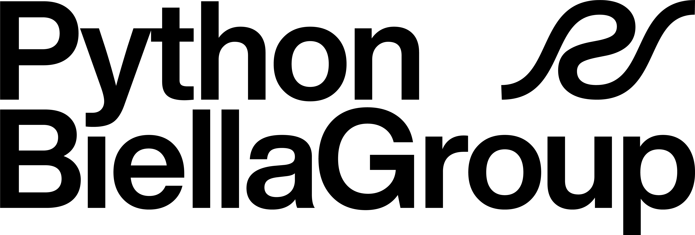
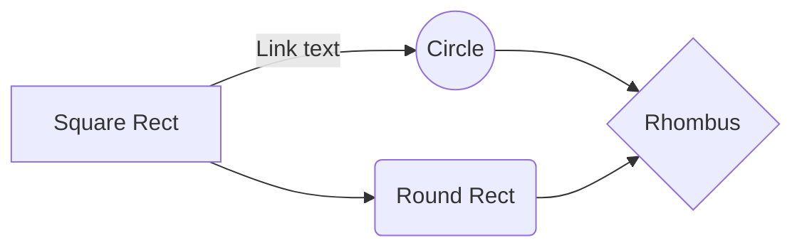

## Inserire immagini

---

## Creare dei banner

E' possibile inserire dei banner all'interno del file markdown.
Crea il tuo badge personalizzato con https://shields.io/badges

---

## Visualizzare video youtube

<iframe width="560" height="315" src="https://www.youtube.com/embed/tFVlX2FZeW0" title="YouTube video player" frameborder="0" allow="accelerometer; autoplay; clipboard-write; encrypted-media; gyroscope; picture-in-picture; web-share" allowfullscreen></iframe>

---

## Admonition

Admonition con titolo.

!!! note

    Lorem ipsum dolor sit amet, consectetur adipiscing elit. Nulla et euismod
    nulla. Curabitur feugiat, tortor non consequat finibus, justo purus auctor
    massa, nec semper lorem quam in massa.

Admonition collassata

??? abstract

    Lorem ipsum dolor sit amet, consectetur adipiscing elit. Nulla et euismod
    nulla. Curabitur feugiat, tortor non consequat finibus, justo purus auctor
    massa, nec semper lorem quam in massa.

Admonition collassabile 

???+ tip

    Lorem ipsum dolor sit amet, consectetur adipiscing elit. Nulla et euismod
    nulla. Curabitur feugiat, tortor non consequat finibus, justo purus auctor
    massa, nec semper lorem quam in massa.

---

## Grafici con mermaid

E' possibile inserire grafici **mermaid** all'interno di un markdown con il plugin [mkdocs-mermaid2-plugin](https://mkdocs-mermaid2.readthedocs.io/en/latest/)

## Equazioni scientifiche

Con mkdocs material é possibile includere espressioni matematiche complesse tramite **MathJax** e **KaTex**

https://squidfunk.github.io/mkdocs-material/reference/math/

$\sum_{i=0}^n i^2 = \frac{(n^2+n)(2n+1)}{6}$

Inline Equation: \(E=mc^2\)

Exponents: \(x^2\)

Square Root: \(\sqrt{x}\)

Summation: \(\sum_{i=1}^{n} x_i\)

Integrals: \(\int_{a}^{b} f(x) dx\)

Greek Letters: \(\alpha, \beta, \gamma\)

Matrices: 
\[
\begin{bmatrix}
1 & 2 \\    
3 & 4
\end{bmatrix}
\]

Limits: \(\lim_{x \to \infty} f(x)\)

Vector: \(\vec{v} = \langle v_1, v_2, v_3 \rangle\)

Piecewise function:
\[f(x) = 
\begin{cases} 
x, & \text{if } x \geq 0 \\
-x, & \text{if } x < 0 
\end{cases}
\]

Probability: \(P(A \cup B) = P(A) + P(B) - P(A \cap B)\)

Derivatives: \(\frac{d}{dx} (x^2 + 2x + 1)\)

Binomial Coefficients: \(\binom{n}{k}\)

Trigonometric Functions: \(\sin(\theta)\), \(\cos(\theta)\), \(\tan(\theta)\)

---

## Componenti neuteroi

### Timeline

::timeline::

- content: First implementation.
  sub_title: 2022-Q1
  title: Launch
- content: Lorem ipsum dolor sit amet, consectetur adipiscing elit.
  sub_title: 2022-Q2
  title: New features
- content: Lorem ipsum dolor sit amet.
  sub_title: 2022-Q3
  title: More features!
- content: Lorem ipsum dolor sit amet.
  sub_title: 2022-Q4
  title: Bugs!

::/timeline::

### Cards

::cards::

- title: Bards
  content: Lorem ipsum dolor sit amet.
  image: https://upload.wikimedia.org/wikipedia/commons/f/f0/Google_Bard_logo.svg

- title: ChatGPT
  content: Lorem ipsum dolor sit amet.
  image: https://upload.wikimedia.org/wikipedia/commons/thumb/0/04/ChatGPT_logo.svg/1024px-ChatGPT_logo.svg.png

::/cards::

---

## Embed PDF file

E' possibile embeddare un pdf mediante l'estensione [mkdocs-pdf](https://pypi.org/project/mkdocs-pdf/) dopo averla inserita come plugin nel mkdocs.yml.

Si può inoltre dimensionare la preview del nostro pdf.

{ type=application/pdf style="min-height:45vh;width:100%"}